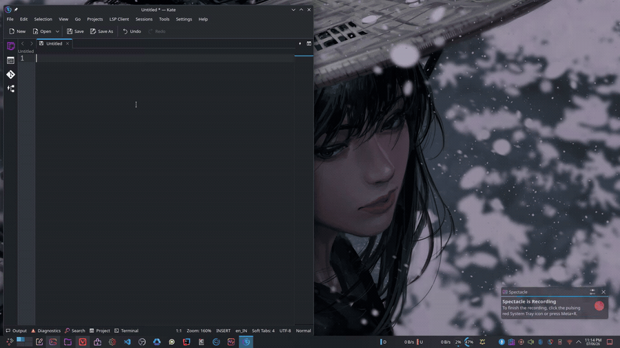

# 🎤 Typefree

[](LICENSE)


[](https://github.com/Iamhero337/typefree/stargazers)

**Type with your voice, anywhere on Linux.** Hold a hotkey, speak, release — your
words are transcribed by [OpenAI Whisper](https://github.com/openai/whisper)
(fully offline) and typed straight at your cursor, in any app: browser,
terminal, editor, chat.

It's the Linux answer to Windows' `Win+H` — and it works on **Wayland** (KDE,
GNOME, …) *and* X11.

```
Hold Right-Ctrl →  speak  →  release  →  text appears where your cursor is
```

## Demo

<!-- Record a ~20s clip (hold Right Ctrl, talk, watch the text land), save it as
     docs/demo.gif, then uncomment the next line. Capture guide: docs/README.md -->
<!--  -->

> 📹 A short screen recording goes here — see [`docs/README.md`](docs/README.md)
> for a two-command way to capture one on Wayland.

---

## Why this exists

Wayland deliberately blocks apps from grabbing global hotkeys or injecting
keystrokes (the tricks `pynput`/`xdotool` rely on). Typefree works *with* the
kernel instead:

| Need              | How Typefree does it                                  |
|-------------------|-------------------------------------------------------|
| Global hotkey     | reads `/dev/input` directly via **evdev** (X11+Wayland)|
| Type at cursor    | **ydotool** + **ydotoold** inject via `/dev/uinput`    |
| Clipboard         | **wl-copy** (Wayland) / **xclip** (X11)               |
| Speech → text     | **OpenAI Whisper**, offline, on your machine          |

> ⚠️ Ubuntu ships `ydotool` 0.1.8, which has **no daemon** and drops the first
> few characters it types. The installer builds **ydotool 1.x** from source so
> typing is reliable (verified: full string round-trips, zero drops).

---

## Requirements

- Linux with Wayland or X11 (tested on KDE Plasma / Wayland)
- Python 3.9+
- A microphone
- ~150 MB for the Whisper `base` model (downloaded on first run)
- `sudo` once, for installing packages + a udev rule

## Install

```bash
git clone https://github.com/Iamhero337/typefree.git
cd typefree
bash install.sh
```

The installer:
1. installs system deps (portaudio, ffmpeg, wl-clipboard, build tools)
2. builds & installs **ydotool 1.x + ydotoold**
3. `pip install`s the Python deps
4. adds you to the **`input`** group and installs a udev rule for `/dev/uinput`
5. installs + enables two user services: `ydotoold` and `typefree`

### ⚠️ One-time step: log out and back in

Reading the keyboard needs your login session to be in the **`input`** group.
Group membership only updates on a fresh login, so:

```bash
# after install: log out and back in (or reboot), then:
systemctl --user start typefree.service
bash status.sh
```

After that it auto-starts on every boot.

## Usage

1. **Hold `Right Ctrl`**
2. **Speak**
3. **Release**

Your speech is transcribed, **typed at the cursor**, and **copied to the
clipboard** (so you can paste with `Ctrl+V` too).

## Configuration

Edit `~/.config/typefree/config.json`:

```json
{
  "hotkey": "rightctrl",  // letter, "space", "f1".."f12", or a non-letter key
                          // like "rightctrl"/"rightalt"/"menu"/"pause"
  "modifier": "none",     // alt | ctrl | shift | super | none
  "mode": "hold",         // hold = hold-to-talk | toggle = press on/off
  "model": "base",        // tiny | base | small | medium | large
  "language": "en",       // language code, or "auto" to detect
  "type_out": true,       // type at the cursor
  "clipboard": true,      // also copy to clipboard
  "sample_rate": 16000
}
```

> The default is **Right Ctrl** on purpose: it needs no Fn key and types no
> character, so it can't leak text into the focused app. A *letter* hotkey like
> `Alt+Z` can leak its letter (or flood `zzzz` via autorepeat) because the
> daemon reads the keyboard without consuming the keystroke.

Apply changes:

```bash
systemctl --user restart typefree.service
```

**Tips**
- Want push-to-toggle instead of push-to-talk? Set `"mode": "toggle"` (press
  once to start, again to stop).
- More accuracy? Use `"model": "small"` or `"medium"` (slower, larger download).
- The hotkey is chosen during install and stored in `config.json` (the service
  unit no longer hardcodes it). The env vars `TYPEFREE_HOTKEY`,
  `TYPEFREE_MODIFIER`, `TYPEFREE_MODE`, `TYPEFREE_MODEL`, `TYPEFREE_LANGUAGE`
  still override the config if you set them yourself.

## Commands

```bash
bash status.sh      # are the services up? is the input group active?
bash logs.sh        # live logs
bash uninstall.sh   # remove everything

systemctl --user restart typefree.service
systemctl --user stop typefree.service
```

## How it works

```
  ┌────────────┐  Right-Ctrl ┌───────────┐  audio   ┌──────────┐
  │  keyboard  │──────────▶ │ typefree  │ ───────▶ │ Whisper  │
  │ /dev/input │   evdev    │  daemon   │          │ (offline)│
  └────────────┘            └─────┬─────┘          └────┬─────┘
                                  │ text                 │ text
                    ┌─────────────┴───────────┐          │
                    ▼                          ▼          │
              ydotool → /dev/uinput       wl-copy ◀───────┘
              (types at cursor)          (clipboard)
```

## Troubleshooting

**Nothing happens on Right Ctrl**
- `bash status.sh` — is `typefree` running and the `input` group active?
- If the group isn't active, log out/in.

**Text is copied but not typed at the cursor**
- Check `ydotoold` is running: `systemctl --user status ydotoold.service`
- Confirm `/dev/uinput` is `crw-rw---- root input`: `ls -l /dev/uinput`

**No speech detected / poor accuracy**
- Check the mic: `arecord -l`, and your default source in `pavucontrol`.
- Try a bigger model (`small`/`medium`) in the config.

**Wrong keyboard layout in typed text**
- ydotool types by keycode; exotic layouts may differ. File an issue.

## Uninstall

```bash
bash uninstall.sh
```

It also prints the manual cleanup commands (udev rule, `input` group, pip pkgs).

## Docs

- [`architecture.md`](architecture.md) — how it works and why, in depth.
- [`memory.md`](memory.md) — project handoff log: what we did, why, what's next.

## License

MIT — see [LICENSE](LICENSE).
